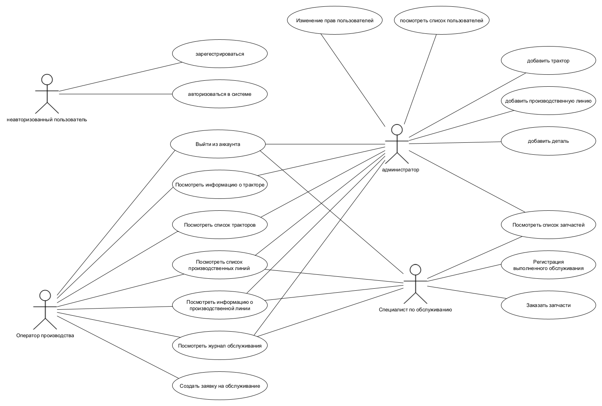
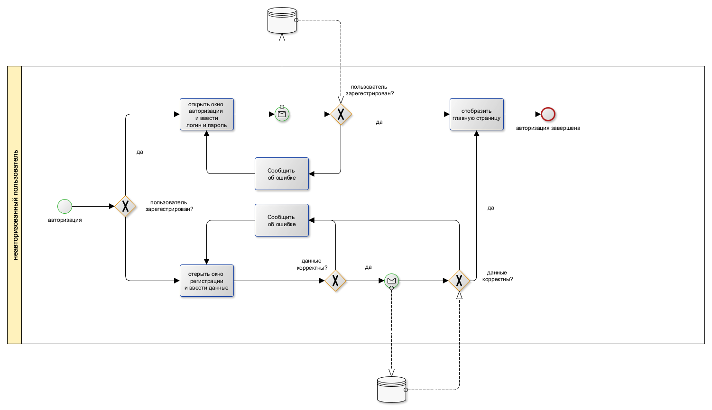
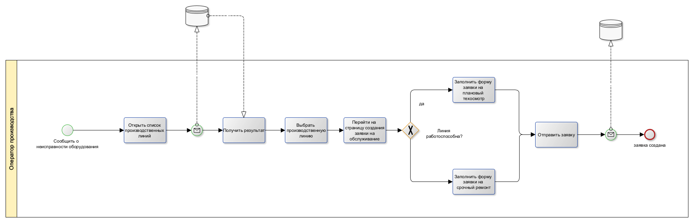
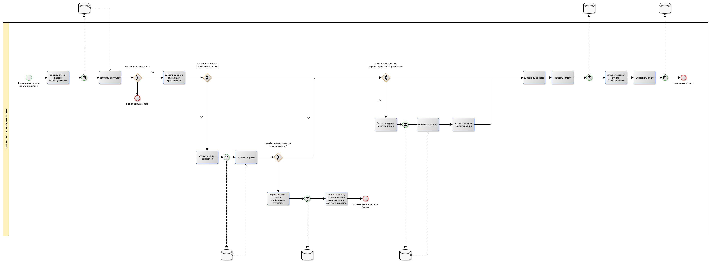
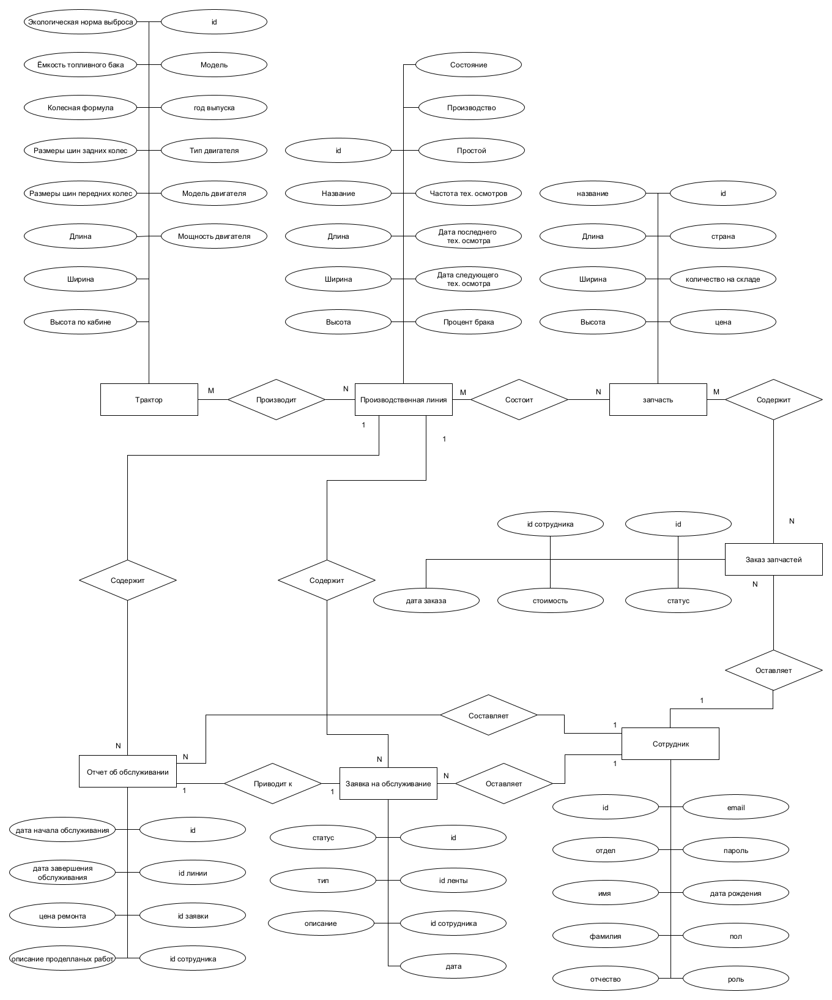
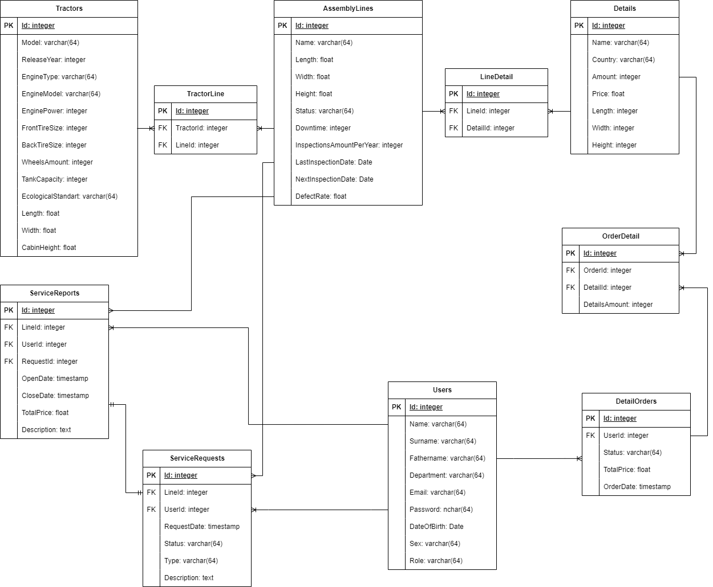
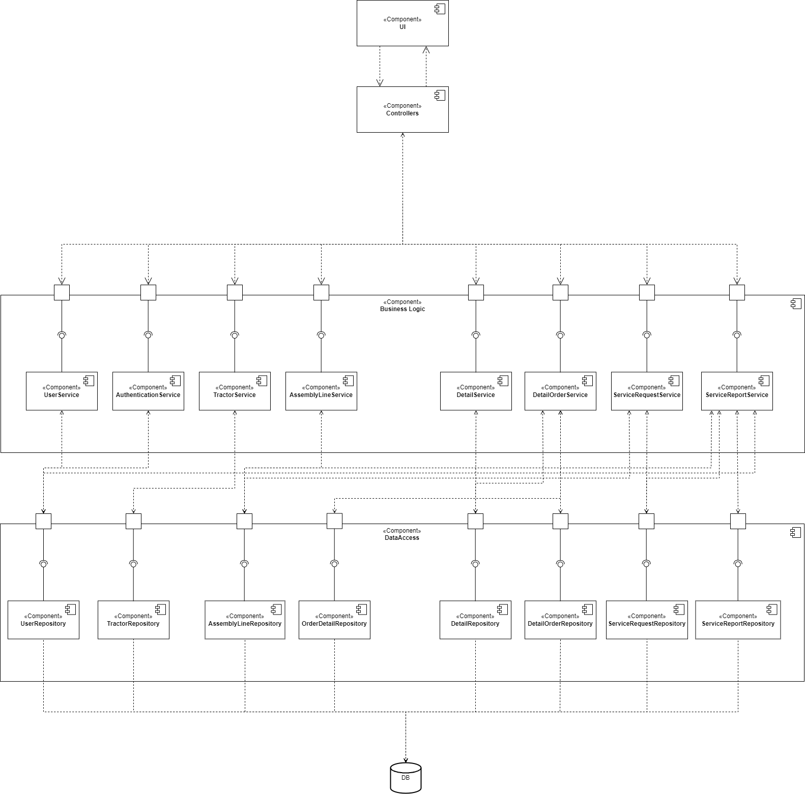

# Cистема мониторинга на тракторном заводе

1. **О проекте**

    Автоматизация производственных процессов на тракторном заводе имеет стратегическое значение для повышения эффективности производства и конкурентоспособности предприятия. Разработка базы данных и приложения для мониторинга поможет улучшить управление ресурсами, уменьшить затраты и увеличить производительность труда.
    Разрабатываемое приложение представляет собой комплексное решение для управления производственными процессами на тракторном заводе. Она включает в себя базу данных для хранения информации о сотрудниках, тракторах, производственных линиях, техническом обслуживании и запчастях. Приложения доступа к базе данных позволят оперативно управлять данными, отслеживать состояние оборудования, планировать и отслеживать процессы обслуживания техники.

2. **Краткий перечень функциональных требований**

    1. Пользовательская аутентификация и авторизация

        Вход в систему по электронной почте и паролю.
        
        Поддержка различных ролей пользователей 
       
        Ограничение доступа к различным функциям в зависимости от роли пользователя.

        Выход из системы

    2. Управление пользователями

        Регистрация новых пользователей.
        
        Управление ролями пользователей администратором (назначение ролей).

    3. Управление заказами и производственными линиями

        Создание, обновление и просмотр производственных линий, тракторов и деталей.
        
        Создание и управление заказами на детали.
        
        
    4. Мониторинг состояния оборудования
        
        Отправка запросов на обслуживание и ремонт оборудования.
        
        Отображение отчетов об обслуживанию производственных линий.

    8. Логирование и мониторинг системы

        Ведение логов всех действий в системе.
       
        Отслеживание ошибок и критических событий с помощью системы логирования.

3. **Use-case диаграмма**

    
    
4. **Bpmn диаграммы основных бизнес-процессов**

    
    
    
    
5. **Пользовательские сценарии**:

    __Сценарий 1: Просмотр информации о текущем состоянии производства (Оператор производства)__

	1. Оператор производства входит в систему, используя свои учетные данные.
	2. Оператор выбирает в меню "Производственные линии".
	3. Система отображает общую информацию о производственных линиях.
	4. Оператор может дополнительно просматривать детальную информацию о состоянии конкретных производственных линий, если это необходимо.

	__Сценарий 2: Создание заявки на обслуживание (Оператор производства)__

	1. Оператор производства входит в систему, используя свои учетные данные.
	2. Опреатор выбирает в меню функцию "Производственные линии".
	3. Опреатор выбирает линию, нуждающуюся в ремонте.
	4. Опреатор заполняет форму заявки на обслуживание.
	5. Оператор подтверждает создание заявки.

	__Сценарий 3: Проведение обслуживания производственной линии (Специалист по обслуживанию)__

	1. Специалист по обслуживанию входит в систему, используя свои учетные данные.
	2. Просматривает список заявок на обслуживание и выбирает заявку для проведения работ.
	3. Система отображает детали заявки.
	4. Специалист открывает отцет об обслуживании.
	5. После выполнения всех необходимых работ, специалист заполняет необходимые поля и закрывает отчет об обслуживании.

6. **ER-диаграмма сущностей**

    

7. **Диаграмма БД**

    

8. **Компонентная диаграмма системы**
    

9. **Экраны будущего web-приложения на уровне черновых эскизов.**

    https://www.figma.com/design/zQKeTq0IebLp4mZryq9b1S/Untitled?node-id=0-1&m=dev&t=hk1owf58DqmN5mCz-1

